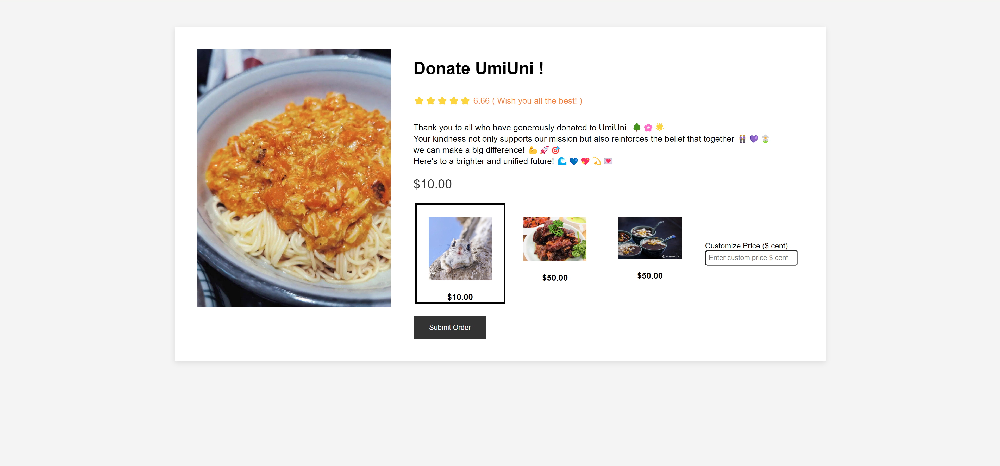
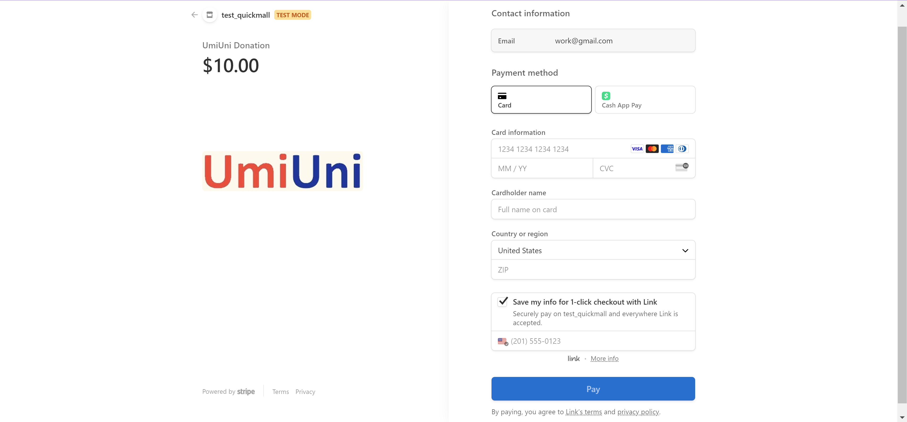
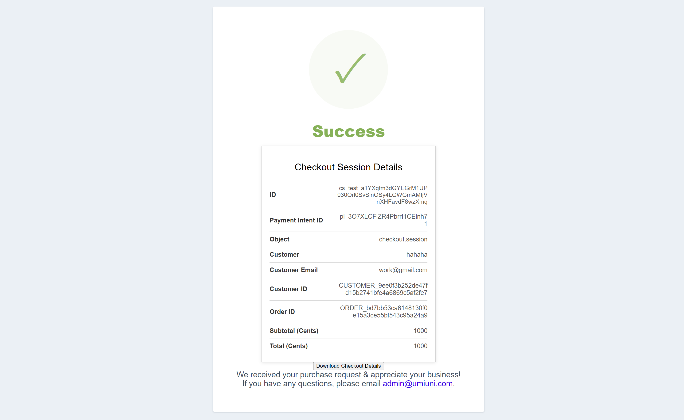
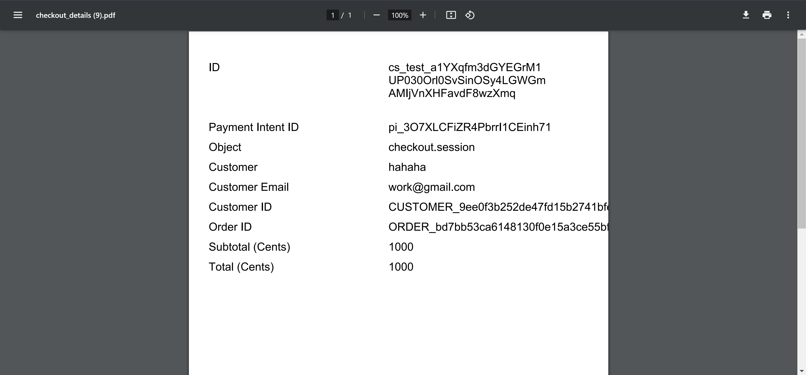

# Please check Full-Stack-stripe-customer-checkout code Here: [[Link]](https://github.com/coco2023/Transaction_Sys/tree/main/full-stack)

This project is the order-checkout process using Stripe Payment. 

## Running the sample

1. Build the server

~~~
mvn package

or:
npm init -y
npm install express stripe dotenv
npm install body-parser
npm install express
npm install
~~~

2. Run the server

~~~
java -cp target/sample-jar-with-dependencies.jar com.stripe.sample.Server

or:
node Server.js
~~~

3. Go to [http://localhost:4242/product-details.html](http://localhost:4242/product-details.html)

4. Demo:
   - product-details-page
   
   - checkout-page
    
   - successfully-checkout-page
    
   - download-receipt
    
